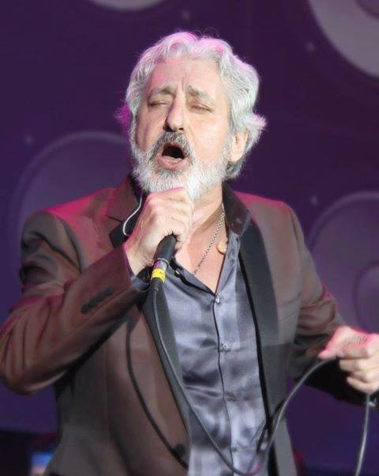
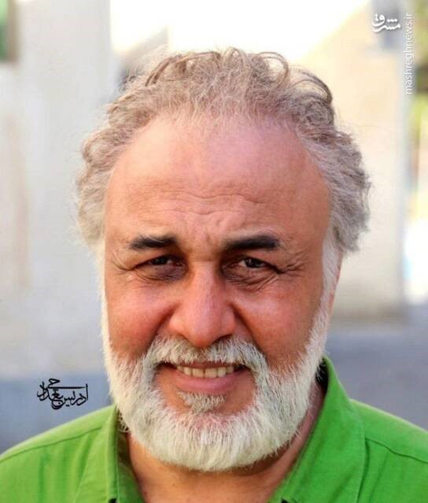
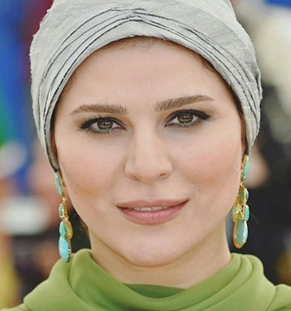
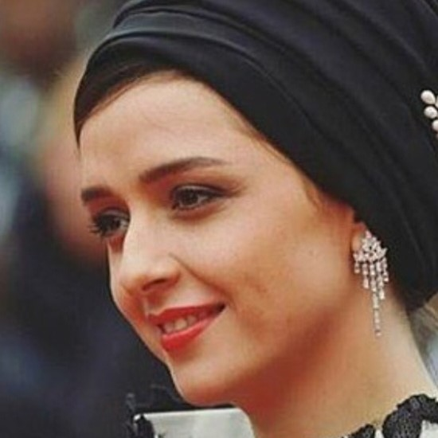
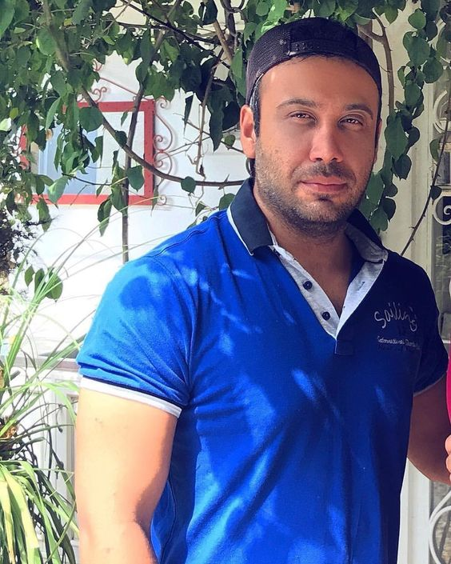

# Face Recognition Project

This repository contains the source code for a celebrity face recognition system built with Flask and TensorFlow. It leverages a pre-trained ensemble model to classify images into predefined categories of Iranian celebrities. The project demonstrates how to build, train, and deploy a machine learning model for a practical application.

## Project Structure

- `preprocess and train`: Contains the Jupyter Notebook for preprocessing the data and training the ensemble model.
- `static`: Stores static files like CSS, images for the web app.
- `templates`: Holds HTML templates for rendering the web application.
- `test`: Includes test scripts or data for the application.
- `app.py`: The main Flask application file for running the web server.

## Quick Start

1. **Set Up Environment**:
   Ensure Python 3.8 and pip are installed. Install the required libraries:
   ```bash
   pip install flask tensorflow
   ```

2. **Run the Application**:
   Execute the Flask application by running:
   ```bash
   python app.py
   ```

3. **Access the Web Interface**:
   Open a web browser and go to `http://localhost:5000` to view the application.

## Model Training and Evaluation

For details on data preprocessing, model training, and evaluation, refer to the [`preprocess and train`](preprocess%20and%20train/) directory. It provides comprehensive instructions on preparing the dataset, training the ensemble model, and evaluating its performance with detailed accuracy metrics.


## Sample Classifications

The system can recognize the following celebrities:

<table>
    <tr>
      <td><br>0: Ali Daei</td>
      <td><br>1: Alireza Beiranvand</td>
      <td><br>2: Bahram Radan</td>
      <td><br>3: Ebi</td>
      <td><br>4: Golshifteh Farahani</td>
      <td><br>5: Hayedeh</td>
    </tr>
    <tr>
      <td><br>6: Homayoon Shajarian</td>
      <td><br>7: Javad Razavian</td>
      <td><br>8: Mehran Ghafourian</td>
      <td><br>9: Mehran Modiri</td>
      <td><br>10: Mohamad Esfehani</td>
      <td><br>11: Reza Attaran</td>
    </tr>
    <tr>
      <td><br>12: Sahar Dolatshahi</td>
      <td><br>13: Seyed Jalal Hosseini</td>
      <td><br>14: Taraneh Alidoosti</td>
      <td><br>15: Googoosh</td>
      <td><br>16: Mohsen Chavoshi</td>
      <td><br>17: Mahan Veisi</td>
    </tr>
  </table>
Each class has been accurately predicted by the ensemble model, with an overview of each class provided in the application.

## Application Architecture

This application utilizes Flask, a lightweight and versatile web framework in Python, to serve as the backend. Flask handles routing and server-side logic, including image uploads and model inference. The front end is built using HTML and CSS, providing a user-friendly interface for interacting with the application. Once set up, the application can be accessed locally through a web browser, allowing users to upload images and view the classification results in real-time.

### Backend

The **Flask backend** is configured to handle image uploads, where uploaded images are processed and classified using the pre-trained TensorFlow model. The predictions are then sent back to the frontend.

### Frontend

The frontend is designed with simplicity in mind, using basic HTML for structure and CSS for styling. It offers an intuitive layout where users can upload images to be classified, and view both the images and their predicted classes.

By running the application on your local machine, you can interact with the model directly through the web interface hosted at `http://localhost:5000`.

## Application Performance

After launching the application, you can upload images for classification. Here’s a demonstration of the application's performance:


## Conclusion

This project showcases the integration of machine learning models into a web application, demonstrating practical deployment and interaction with a user interface. For further improvements, consider expanding the dataset, refining the model with more advanced techniques, or optimizing the web application for production environments.

## License

This project is licensed under the MIT License - see the [LICENSE](LICENSE) file for details.
