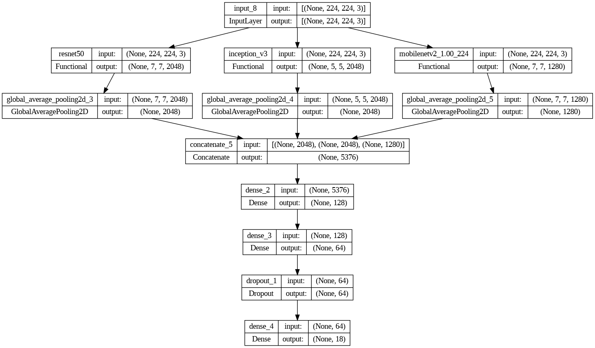
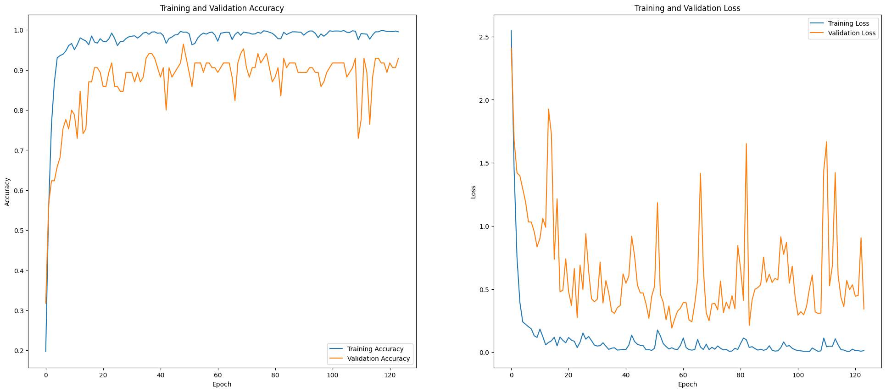

# Celebrity Face Recognition Using Ensemble Model

[](https://colab.research.google.com/drive/1egf7l4c_riqb2pxKrEM3nz9kksP3ljyB?usp=sharing)


This repository hosts a Jupyter Notebook that documents the end-to-end process of building a celebrity face recognition model. The project utilizes TensorFlow and Keras to build an ensemble of convolutional neural networks (CNNs) for classifying images into distinct Iranian celebrity categories based on their facial features.

## Table of Contents

- [Setup](#setup)
- [Preprocessing](#preprocessing)
  - [Data Loading and Image Resizing](#data-loading-and-image-resizing)
  - [Visualizing the Data](#visualizing-the-data)
  - [Data Augmentation](#data-augmentation)
  - [Splitting the Data](#splitting-the-data)
  - [Data Normalization and Preparation](#data-normalization-and-preparation)
- [Model Training and Evaluation](#model-training-and-evaluation)
  - [Preliminary Model: MobileNetV2](#preliminary-model-mobilenetv2)
  - [Advanced Ensemble Model](#advanced-ensemble-model)
- [Testing on Real-World Data](#testing-on-real-world-data)
- [Conclusion](#conclusion)
- [Evaluation and Analysis](#evaluation-and-analysis)
- [Results](#results)
- [Contributing](#contributing)

## Setup

**Running the Notebook in Google Colab**
- The notebook is designed for easy execution in Google Colab, requiring no additional setup other than a Google account and internet access.😊

The code is designed to run in a Python environment with essential machine learning and simulation libraries. You can execute the notebook directly in Google Colab using the badge link provided, which includes a pre-configured environment with all necessary dependencies.


## Preprocessing

### Data Loading and Image Resizing

Images stored in directories named after each celebrity are loaded and resized to a uniform dimension of 224x224 pixels—ideal for CNN input. Each image is labeled based on its parent directory, aligning with the respective celebrity's name. This automated labeling facilitates straightforward training and validation:

### Visualizing the Data

To verify that images are correctly loaded and to understand the dataset's composition, we display a sample of the images. This visualization step checks the integrity of the image loading and resizing process and offers a quick glimpse into the data's variety and quality:


### Data Augmentation

To enhance model robustness and mitigate overfitting, training images undergo augmentation. Transformations such as rotations, shifts, shearing, flipping, and brightness adjustments are applied. These augmentations help the model generalize better by simulating various real-world conditions:

```python
ImageDataGenerator(
    rotation_range=90,
    width_shift_range=0.1,
    height_shift_range=0.1,
    shear_range=0.30,
    horizontal_flip=True,
    fill_mode='nearest',
    brightness_range=[0.8, 1.2]
)
```


### Splitting the Data

To ensure effective training and unbiased evaluation, the dataset is divided into training, validation, and test sets using stratified sampling. This method helps maintain an equal distribution of classes across each set, crucial for training unbiased and generalized models:

```python
X_train, X_temp, y_train, y_temp = train_test_split(images, labels, test_size=0.15, random_state=10, stratify=labels)
X_val, X_test, y_val, y_test = train_test_split(X_temp, y_temp, test_size=0.5, random_state=10, stratify=y_temp)
```

The distribution of classes in each dataset part is visualized to confirm uniformity and appropriate representation:

<table>
  <tr>
    <td>Train Distribution<br></td>
    <td>Validation Distribution<br></td>
    <td>Test Distribution<br></td>
  </tr>
</table>


### Data Normalization and Preparation

After partitioning the data, each image's pixel values are normalized to a range of 0 to 1 to facilitate efficient training. This normalization process aids in achieving faster convergence during model training. Furthermore, image labels are converted into one-hot encoded vectors to suit the model's categorical classification needs. These steps ensure the data is in the optimal format for feeding into our neural network, setting a strong foundation for robust model performance.

## Model Training and Evaluation

After the rigorous preprocessing phase, the focus shifts to training and evaluating machine learning models. Two methods are employed in this project: a preliminary model using MobileNetV2 and a more sophisticated ensemble model that combines features from three different architectures.

### Preliminary Model: MobileNetV2
Initially, a lightweight model based on MobileNetV2, known for its efficiency on mobile devices, was implemented. This model was augmented with custom layers to specifically handle our face recognition task. However, it struggled with the dataset's complexity, achieving modest validation and test accuracies.

### Advanced Ensemble Model
Given the limitations observed with the preliminary model, a robust ensemble approach was adopted. This method leverages the strengths of three distinct CNN architectures: ResNet50, InceptionV3, and MobileNetV2. By freezing the initial layers and fine-tuning the deeper ones, the ensemble model captures diverse facial features more effectively.

### **Training Dynamics**:
- **Model Configuration**: Layers from each base model are frozen to preserve learned features, with only the last ten layers of each to be fine-tuned.
- **Compilation**: The ensemble model uses an Adam optimizer with a learning rate of 0.0001 and categorical crossentropy loss, suitable for multi-class problems.
- **Training Process**: Incorporates early stopping and model checkpointing to enhance performance and prevent overfitting, training over several epochs with batch size set to 32.




### **Evaluation**:
- **Performance Metrics**: The model's training journey is depicted through accuracy and loss plots, illustrating the learning curve and the balance between learning and overfitting.
- **Accuracy Achievements**: Although halted prematurely due to GPU constraints, the model showed promising results with validation accuracy peaking significantly higher than the initial simple model.
  
### **Results Visualization**:
The below graphs provide insights into the training and validation phases, underlining the challenges and achievements of the ensemble model:



### **Final Model Accuracies**: 
The ensemble model demonstrated exceptional performance with an accuracy of **100.00%** on the training set, highlighting perfect learning on the training data. Validation accuracy reached **96.47%**, indicating strong generalization to new data. Finally, the model achieved **90.70%** accuracy on the test set, confirming its robustness and effectiveness in handling unseen data. Despite these impressive results, there's potential for further improvement with enhanced computational resources such as increased GPU and RAM, which would allow for more extensive data handling and more complex model training.

## Ready for Application
Integration The ensemble model has demonstrated its capability to effectively recognize celebrity faces with high accuracy, confirming its readiness for integration into real-world applications. This ensures the model performs robustly, not just in controlled test environments, but also in practical, everyday use scenarios.

## Conclusion

This project successfully demonstrates the use of TensorFlow and Keras to build an ensemble model for celebrity face recognition. Through rigorous preprocessing and leveraging advanced CNN architectures, the model achieved high accuracy and robust performance on both validation and test sets. Despite computational constraints, the ensemble approach significantly improved the model's ability to generalize, highlighting its potential for real-world applications. Future improvements could include expanding the dataset and utilizing enhanced computational resources to further refine and extend the model's capabilities.


