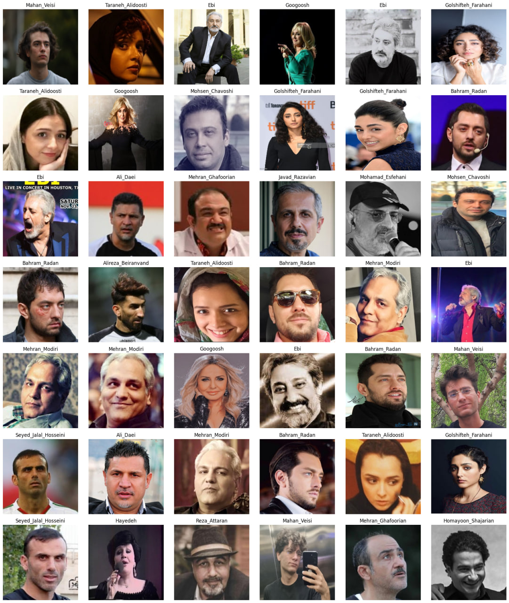
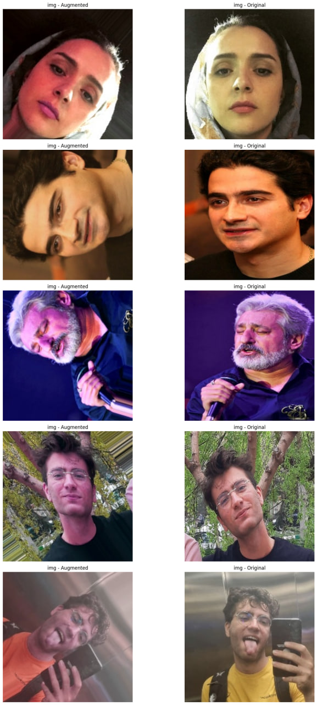
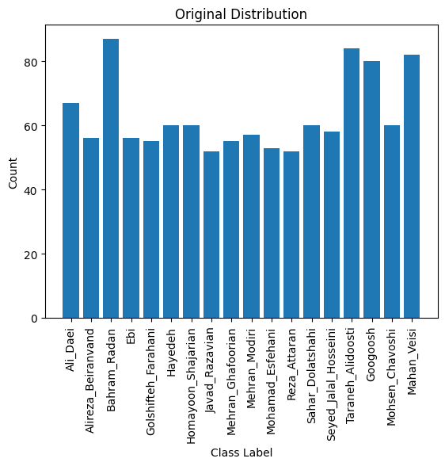
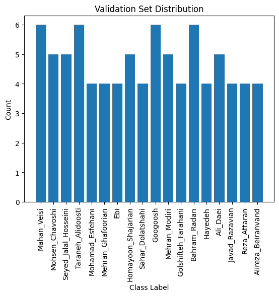

# Celebrity Face Recognition Using TensorFlow and Keras

[](https://colab.research.google.com/drive/1egf7l4c_riqb2pxKrEM3nz9kksP3ljyB?usp=sharing)


This repository hosts a Jupyter Notebook that documents the end-to-end process of building a celebrity face recognition model. The project utilizes TensorFlow and Keras for building an ensemble of convolutional neural networks (CNNs) to classify images into distinct **iranian** celebrity categories based on their facial features.

## Table of Contents
- [Project Overview](#project-overview)
- [Setup Instructions](#setup-instructions)
- [Notebook Details](#notebook-details)
  - [Data Preprocessing](#data-preprocessing)
  - [Model Training](#model-training)
  - [Evaluation and Analysis](#evaluation-and-analysis)
- [Results](#results)
- [Contributing](#contributing)

## Project Overview

The notebook includes detailed steps for data handling, preprocessing, model training, and evaluation. It covers the following key aspects:
- Setting up the environment and importing necessary libraries.
- Loading and preprocessing image data.
- Splitting data into training, validation, and test sets.
- Data augmentation to enhance model robustness.
- Building and training an ensemble model using architectures like MobileNetV2 and InceptionV3.
- Evaluating model performance and analyzing misclassifications.

## Setup

**Running the Notebook in Google Colab**
- The notebook is designed for easy execution in Google Colab, requiring no additional setup other than a Google account and internet access.😊
  
The code is designed to run in a Python environment with essential machine learning and simulation libraries. You can execute the notebook directly in Google Colab using the badge link provided, which includes a pre-configured environment with all necessary dependencies.


## Data Loading and Image Resizing

Images stored in directories named after each celebrity are loaded and resized to a uniform dimension of 224x224 pixels—ideal for CNN input. Each image is labeled based on its parent directory, aligning with the respective celebrity's name. This automated labeling facilitates straightforward training and validation:

```python
# Function load_and_resize_image() is used here
```

**Image Placeholder:**
- 

## Visualizing the Data

To verify that images are correctly loaded and to understand the dataset's composition, we display a sample of the images. This visualization step checks the integrity of the image loading and resizing process and offers a quick glimpse into the data's variety and quality:

**Image Placeholder:**
- 

## Data Augmentation

To enhance model robustness and mitigate overfitting, training images undergo augmentation. Transformations such as rotations, shifts, shearing, flipping, and brightness adjustments are applied. These augmentations help the model generalize better by simulating various real-world conditions:

```python
# Using ImageDataGenerator for applying transformations
```

**Image Placeholder:**
- 

## Splitting the Data

To ensure effective training and unbiased evaluation, the dataset is divided into training, validation, and test sets using stratified sampling. This method helps maintain an equal distribution of classes across each set, crucial for training unbiased and generalized models:

```python
# Code snippet for train_test_split showing stratified sampling
```

The distribution of classes in each dataset part is visualized to confirm uniformity and appropriate representation:

<table>
  <tr>
    <td>Train Distribution<br></td>
    <td>Validation Distribution<br></td>
    <td>Test Distribution<br></td>
  </tr>
</table>

**Image Placeholder:**
- 


## Model Training

The project utilizes a combination of different CNN architectures, leveraging pretrained models like MobileNetV2 for feature extraction and custom layers for classification. The training process is detailed with strategies for handling overfitting, such as early stopping and dropout layers.

## Evaluation and Analysis

After training, the model is evaluated on a held-out test set. The performance metrics such as accuracy and loss are plotted over epochs. The notebook also includes a section for visualizing incorrect predictions to analyze the model's weaknesses and potential biases.

## Results

The notebook provides graphs and metrics that demonstrate the model's performance. For instance:
- Training and validation accuracy/loss graphs.
- Test set accuracy.
- Examples of correct and incorrect predictions.

## Contributing

Contributions to this project are welcome! Please feel free to fork the repository, make your changes, and submit a pull request. You can also open issues for bugs you've noticed or features you think would make a valuable addition to the project.


